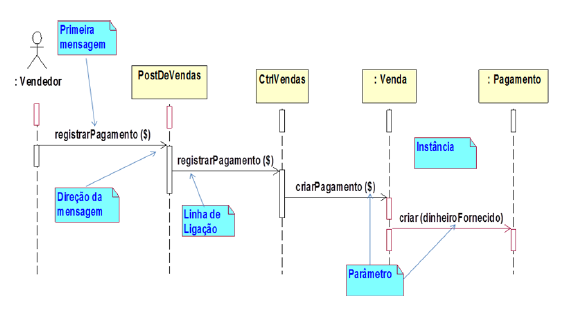
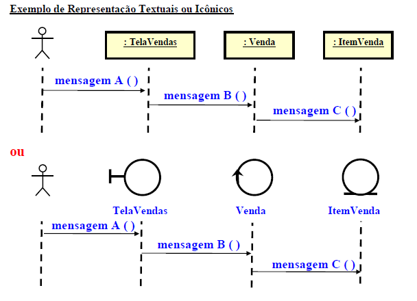
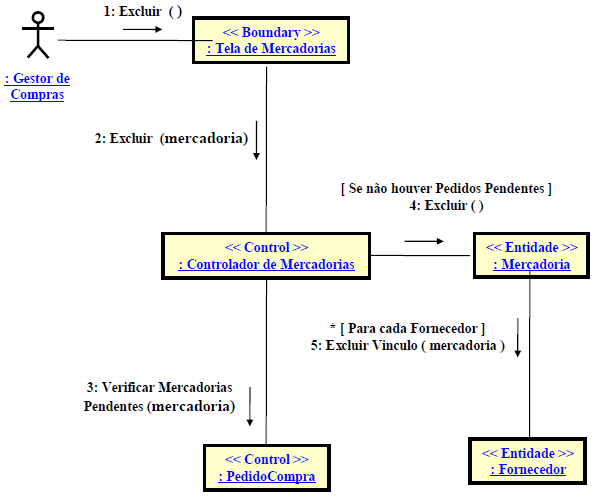
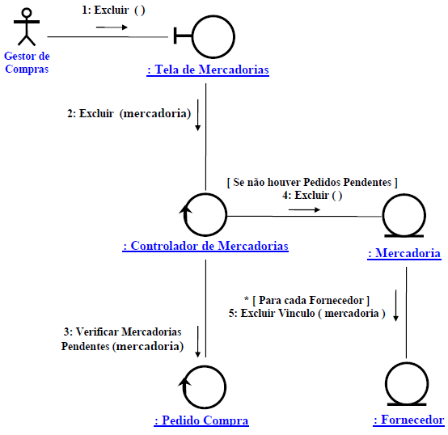

# Revisão

## Diagrama de Sequência

Um diagrama de sequência mostra a comunicação dinâmica entre vários objetos de um sistema. O mais importante é que a partir dele percebe-se a sequência de mensagens enviadas entre os objetos, demonstrando assim a interação entre objetos e algo que acontecerá num ponto específico da execução do sistema.

Note o fluxo a partir de um sistema web, na imagem acima, onde o fluxo é:

    Vendedor > requisição POST > Controller Vendas > Model Venda > Model Pagamento

---

## Diagrama de Comunicação

Neste diagrama, além da troca de mensagens entre os objetos, há também os objetos com seus relacionamentos. As setas de mensagens são desenhadas entre os objetos para mostrar o fluxo de mensagens entre eles, estas mensagens são  nomeadas e mostram a ordem em que elas são enviadas, podendo mostrar ainda condições, interações, valores de resposta etc.

Pode conter ainda objetos ativos (que executam paralelamente com outros).

### Textual

### Icônico

