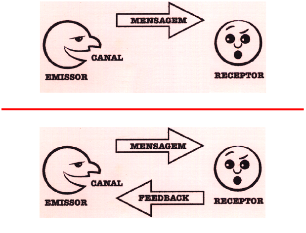
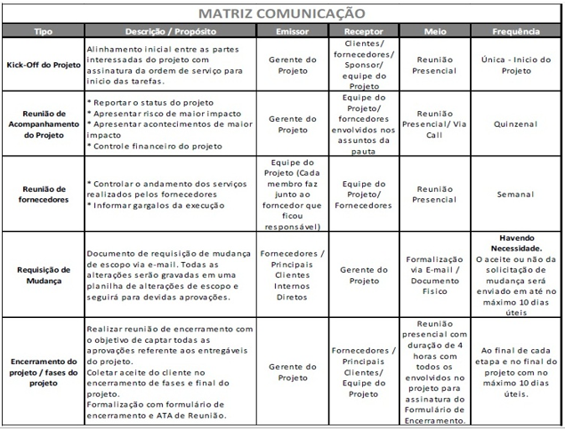

# Revisão

## Gerência de Comunicação

É a área que emprega os processos necessários para garantir a geração, coleta, distribuição, armazenamento, recuperação e destinação final das informações sobre o projeto de forma oportuna e adequada.

## Comunicação

É uma das áreas mais importantes para o gerenciamento de projetos: é o elo de ligação entre o Gerente de Projeto, os stakeholders, a equipe, as ideias e as informações. Tomam até 90% do tempo do gerente e a maioria dos problemas são provenientes de falhas de comunicação.

### Quantidade x Qualidade

A quantia de informações consumidas não garante qualidade, pois assim como informações de menos são prejudiciais, informações em excesso também. Deve haver um equilibrio para garantir a qualidade das informações.

Documentar o mais importante, informações precisas e concisas

**Nota: a imagem abaixo (slide 07) foi enfatizado pelo professor.*

### Tipos de Comunicação

- **Verbal**: conversa direta;
- **Não Verbal**: comunicação por gestos, expressões faciais, aparência etc;
- **Escrita / Gráfica**: emails, relatórios, documentos, mensagens de texto;

## Papéis do Gerente de Projetos

**Nota: o conteúdo abaixo (slide 12) foi enfatizado pelo professor.*

- Alinhar os objetivos do projeto e disseminá-los garantindo comprometimento da equipe;
- Tomar decisão;
- Autorizar trabalho;
- Dirigir atividades;
- Negociar;
- Reportar;
- Administração geral do projeto, como marketing e vendas, relações públicas;
- Administração de registros como atas, memorandos, cartas, boletins, relatórios, especificações, documentos de aquisição.

## Barreiras de Comunicação

**Nota: o conteúdo abaixo (slide 14) foi enfatizado pelo professor.*

- Cultura e Processo Organizacional;
- Uso inadequado de canais de comunicação;
- Uso de linguagem inacessível (gírias, outras línguas);
- Uso de linguagem hostis;
- Distribuição de informação inadequada.

## Planejamento de Comunicação

É necessário planejar como são transmitidas as informações para a equipe, clientes e fornecedores.

É importante um plano com periodicidade, formato e canal de comunicação, estando em conformidade com os levantamentos dos stakeholders e a matriz de responsabilidade.

