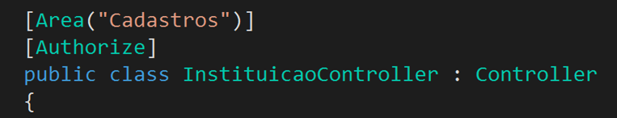

# Revisão

## Sumário

1. [Camada de Apresentação](#Camada-de-apresentação)
    1. [Bootstrap](#Bootstrap)
    2. [JQuery](#JQuery)
    3. [Página de Layout](#Página-de-layout)
2. [Partial Views](#Partial-views)
3. [Camada de Negócio](#Camada-de-negócio)
    1. [Problema](#Problema)
4. [Autenticação e Autorização](#Autenticação-e-autorização)
5. [Exercicios de Revisão](#Exercicios-de-revisão)

> **Notas deste resumo:**
> O material do portal em boa parte se encontra como forma de tutorial para incluir o Bootstrap, Partial Views, Autenticação e Camada de Negócio, logo, todo conteúdo abordado é um resumo de como realizar e o que isto altera no código, podendo assim, **divergir com o apresentado em sala!** Logo, me isento de toda e qualquer responsabilidade para com este resumo, apresentando neste conhecimentos aos quais foram de meu entendimento.

[](https://hackatomic.com)

## Camada de Apresentação

Este slide trata da inclusão de bibliotecas voltadas para o desenvolvimento do front-end:

- [Bootstrap](#Bootstrap);
- [JQuery](#JQuery);
  - JQuery-Validation;
  - JQuery-Validate;
- Datatables;

É importante ter uma atenção especial com a camada de apresentação visto que ela é a "porta de entrada" da sua aplicação. Ela quem trata o visual e a experiência do usuário na aplicação. É importante dar atenção na clareza, organização e visibilidade dos dados, com hierarquia de importância, usando uma interface intuitiva e principalmente dispondo de feedback para as ações do usuário. Como acusar um erro na introdução de dados inválidos ou clique de um botão.

### Bootstrap

É um dos frameworks CSS mais famosos que existem, é utilizado no desenvolvimento de páginas responsivas e *mobile-first<sup>1</sup>*.

*<sup>1: Aplicações onde a interface são feitas primeiro para celulares e depois para computadores.</sup>*

[](https://hackatomic.com)

### JQuery

É uma biblioteca (ou framework) de funções JavaScript, utilizado para simplificar scripts.

### Página de Layout

As páginas de layout construídas no projeto servem como estrutura para evitar a repetição de código comum entre as páginas, como por exemplo a *navbar* (menu superior) da aplicação ou o *footer* (rodapé). Para fazer uma página de Layout, basta:

- Adicionar um novo item `(Ctrl+Shift+A no Windows)` na pasta Views > Shared;
- Selecionar a opção `Layout do Razor`;
- Coloque todo o código que se repetirá (como o `<header>` de sua página por exemplo);
- Use tags do C# como `@RenderSection()` e `RenderBody()` para criar seções dentro do layout e usá-los posteriormente. Exemplo:
  - `@RenderSection("Styles", required: false)`

  - ```html
        <body>
            @RenderBody()
        </body>
    ```

Agora, ao criar uma nova exibição do MVC, marque a opção `Use uma página de Layout` e use o Layout que você criou. Note que no início dos seus arquivos `.cshtml` você possuirá a estrutura:

```cshtml
@{
    ViewData["Title"] = "Sistema Acadêmico";
    Layout = "~/Views/Shared/_Layout.cshtml";
}
```

Todo o resto do código após estas linhas serão renderizadas dentro da seção definida pela tag `@RenderBody()` do seu Layout.

[](https://hackatomic.com)

## Partial Views

De acordo com os slides, partial views são views que contêm código (HTML e/ou Razor) e são projetadas para serem renderizadas como parte de uma visão. Elas **não** possuem layouts, como as views, mas podem ser inseridas dentro de diversas views, como um componente.

> Eu gosto de dizer que Partial Views funcionam como layouts, da forma inversa, um layout é feito para ser uma base geral onde o conteúdo é modificado pela tela (usando o RenderBody), já uma Partial View é um componente específico para se encaixar dentro de qualquer tela.

Logo, podemos dizer quer estruturalmente temos:

- Layout > View > Partial

> Saiba mais em: <https://docs.microsoft.com/en-us/aspnet/core/mvc/views/partial?view=aspnetcore-3.0>

Para incluir uma Partial View em uma View, basta adicionar a tag Razor:

```html
<div id="exemplo">
    @{
        await Html.RenderPartialAsync("~/Views/Instituicao/PartialView.cshtml", Model.Departamentos.ToList());
    }
</div>
```

[](https://hackatomic.com)

## Camada de Negócio

Aplicação do princípio de arquitetura limpa e a camada de negócio:

### Problema

Conforme o crescimento, toda a aplicação fica acumulada em um único projeto e as classes de controle acumulam as responsabilidades, dificultando a legibilidade e manutenibilidade do código.

### Solução

Crie uma biblioteca para a camada de negócio (botão direito na solução -> adicionar -> novo projeto -> Biblioteca de Classes), vamos chamá-lo de "Modelo".

Agora, referêncie a biblioteca na aplicação web (botão direito nas dependências do projeto -> selecione o Modelo)

### Camada de Persistência

É aonde você criará as funções responsáveis pelo CRUD e pelo retorno de dados da classe/modelo em questão, exemplo: `InstituiçãoDAL` - Utiliza-se DAL como convenção de nomenclatura para códigos da Camada de Persistência:


### Camada de Aplicação

O controller da classe modificada agora passa a referenciar o `DAL` criado e utiliza as funções criadas para tornar o código mais limpo:


### Resumindo

A arquitetura de código limpo refatora o código presente no `Controller`, criando duas novas camadas: a de persistência e de aplicação, sendo que a de persistência cria o arquivo DAL e a de aplicação refatora o controlador existente.

[](https://hackatomic.com)

## Autenticação e Autorização

Todo mundo sabe o que é autenticação e autorização mas ok, basicamente:

**Autenticação:**

- Valida se um usuário possui direitos ao acesso de uma aplicação;

**Autorização:**

- Verifica se um usuário **autenticado** possui direito aos recursos requisitados

### ASP.NET Core Identity

ASP.NET Core identidade é um sistema de associação que dá suporte à funcionalidade de logon da interface do usuário. Os usuários podem criar uma conta com as informações de logon armazenadas em identidade ou podem usar um provedor de logon externo. Os provedores de logon externo com suporte incluem o Facebook, o Google, a conta da Microsoft e o Twitter.

> Mais na documentação oficial: <https://docs.microsoft.com/pt-br/aspnet/core/security/authentication/identity?view=aspnetcore-3.0&tabs=visual-studio>

Para usar a autenticação, precisamos:

- Criar uma classe de usuário da aplicação: `public class UsuarioDaAplicacao : IdentityUser`;
- Modificar a classe de contexto, exemplo: `public class ExemploContext : IndetityDbContext<UsuarioDaAplicacao>`;
- Registrar a injeção de dependência:

  - ```cs
        services.AddIdentity<UsuarioDaAplicacao, IdentityRole>().AddEntityFrameworkStores<ExemploContext>().AddDefaultTokenProviders();

        services.ConfigureApplicationCookie(options => {
            options.LoginPath = "/Rota/Acesso";
            options.AcessDeniedPath = "/Rota/AcessoNegado";
        });
    ```

- Adicionar o método na classe Startup.cs: `app.UseAuthentication();`;

### Regras de Autenticação


#### Exemplo



#### Permitindo uma rota anônima dentro de um Controller com autenticação


[](https://hackatomic.com)

## Exercícios de Revisão

### 1. O que é o Twitter bootstrap?

É um dos frameworks CSS mais famosos que existem, é utilizado no desenvolvimento de páginas responsivas e *mobile-first<sup>1</sup>*.

### 2. Porque é importante ter uma atenção especial para a camada de apresentação?

É importante ter uma atenção especial com a camada de apresentação visto que ela é a "porta de entrada" da sua aplicação. Ela quem trata o visual e a experiência do usuário na aplicação. É importante dar atenção na clareza, organização e visibilidade dos dados, com hierarquia de importância, usando uma interface intuitiva e principalmente dispondo de feedback para as ações do usuário. Como acusar um erro na introdução de dados inválidos ou clique de um botão.

### 3. O que vem a ser o item Bibliotecas do lado do cliente, que é configurado no Visual Studio?

É por onde é feita a inclusão de bibliotecas para o front-end do projeto, isto é, a inclusão de bibliotecas como o Bootstrap e o JQuery.

[](https://hackatomic.com)

### 4. a. Quando são executados os códigos \<environment include=”Development”> e \<environment exclude=”Development”>?

Quando o projeto é inicializado, verifica-se o ambiente em que o projeto está sendo executado, os mais comuns são Desenvolvimento, Homologação e Produção. No caso, os códigos incluem ou excluem as linhas dentro das tags conforme o ambiente configurado.

### 4. b. Qual a finalidade da tag asp-fallback-href?

> Resposta resumida: servem como uma espécie de segunda opção para carregar um recurso indisponível na  opção principal.

Para otimizar o carregamento de páginas web, uma das técnicas para otimização da velocidade de carregamento é usar CDN para as bibliotecas mais conhecidas, pois, se um usuário já visitou um site que usasse o mesmo arquivo daquele CDN que você, ele já se encontra em cache, eliminando o carregamento daquela biblioteca, diminuindo a carga do server e aumentando a velocidade de carregamento do usuário.

Mas, se a CDN estiver offline, os helpers `asp-fallback` são responsáveis por indicar o que carregar quando estes recursos não estiverem disponíveis, temos: `asp-fallback-href`, `asp-fallback-src` e `asp-fallback-test`, que servem para segunda opção do src, do hrf e uma condição de verificação para saber se o fallback seá utilizada ou não, respectivamente.

### 5. Considerando que o trecho de código apresentado a seguir foi extraído do arquivo _LayoutIES.cshtml, o que a função @RenderBody(); deve realizar?

> Essa pergunta tá sem imagem mas tudo bem, risos.

A função `@RenderBody()` é responsável por renderizar o conteúdo do arquivo dentro da seção declarada pela função `@RenderBody` na página de Layout. Exemplo:

Arquivo Layout.cshtml:

```html
    <div>
        @RenderBody
    </div>
```

Arquivo ExemploCreate.cshtml:

```html
    @{
        Layout = "~/Shared/Layout.cshtml";
    }

    <!-- 
Daqui para baixo, todo o conteúdo será          renderizado pela tag @RenderBody, no caso deste exemplo, ele ficara dentro da div que criamos no arquivo anterior
    -->
```

[](https://hackatomic.com)

### 6. Escreva o que os trechos de código das linhas solicitadas estão realizando, considere que ele foi extraído do arquivo Index.cshtml:

```html
2 @{
3   ViewData["Title"] = "Sistema Acadêmico";
4   Layout = "~/Views/Shared/_LayoutIES.cshtml";
5 }
```

#### a. Linha 2:

Na linha 2, inicia-se um bloco Razor.

> Mas como eu to com dúvida desse "linha 2", algo me diz que era pra ser linha 3 e na pergunta debaixo linha 4, então caso ele quisesse perguntar do ViewData, a resposta é como se ele fosse uma variável (uma propriedade), neste caso estamos atribuindo o título da página.

#### b. Linha 3:

Seguindo a lógica do que eu coloquei como opinião ali em cima, vou responder sobre a linha 4 já que to falando sobre todas as linhas:

A linha 4 referencia o arquivo de layout que a página está utilizando.

### 7. Explique a finalidade do trecho de código da linha 53.

```html
52 <div class="card-footer bg-info text-center text-white">
53      <a asp-action="Edit" class="btn btn-warning" asp-route-id="@Model.InstituicaoID">Alterar</a>
54      <a asp-action="Index" class="btn btn-warning">Retornar à listagem de instituições</a>
55 </div>
```

Ele te leva para a action definida no atributo `asp-action`, no caso, "Edit", passando ainda o atributo `asp-route-id` (id que será passado pela URL).

### 8. Qual a finalidade de uma Partial View?

Partial views são views que contêm código (HTML e/ou Razor) e são projetadas para serem renderizadas como parte de uma visão. Elas **não** possuem layouts, como as views, mas podem ser inseridas dentro de diversas views, como um componente.

### 9. Observe a imagem a seguir é indique (circule) onde existe uma Partial View.


#### Resposta:


### 10. Qual a finalidade do trecho de código apresentado na linha 55?

A essa altura do resumo eu já to com preguiça de escrever os códigos ou por a imagem aqui, mas enfim, a linha 55 tem o seguinte:

```html
    @{
        await Html.RenderPartialAsync("~/Views/Instituicao/_ComDepartamentos.cshtml", Model.Departamentos.ToList());
    }
```

> Resposta do StackOverflow: <https://stackoverflow.com/questions/46006910/for-data-validation-where-to-add-html-renderpartialasync-validationscriptspar>

### 11. Qual a finalidade em se dividir uma aplicação em camadas?

Segurança e organização (e manutenção).

### 12. Qual a diferença entre os atributos [Authorize], [Authorize(roles=”funcionário”)] e [AllowAnonymous]?


[](https://hackatomic.com)

### 13. Observando o trecho de código apresentado a seguir responda:

```cs
[HttpPost]
[AllowAnonymous]
[ValidateAntiForgeryToken]
public async Task<IActionResult> RegistrarNovoUsuario(RegistrarNovoUsuarioViewModel model, string returnUrl = null)
```

### 13.a. Em que momento ele é executado?

Quando a rota da action receber uma requisição POST, a action será executada.

### 13.b. Quem está autorizado a executá-lo?

Qualquer pessoa (independente de autenticação).

### 13.c. Qual a finalidade do atributo [ValidateAntiForgeryToken]?

É um método que gera e insere no HTML gerado na view um código para evitar que se falsifique o envio de dados para o servidor.

### 14. Observando a imagem que representa o princípio da arquitetura limpa proposto por Robert Martin, resolva os itens a seguir:


### 14.a. Explique o que significam as setas horizontais presentes nela.

As setas horizontais da imagem que representam as dependências entre as camadas vêm de “fora para dentro”, ou seja, a camada Framework “enxerga” somente a Interface Adapters, que por sua vez “enxerga” somente a User Cases, que finalmente “enxerga” apenas a Entites. Esta é a principal regra da Clean Architecture, e talvez sua única: o Princípio da Dependência.

As camadas internas não devem ter qualquer dependência das externas, nem indiretas, como nomes de variáveis, funções ou termos.

Provavelmente você terá mais abstrações nas camadas internas e mais implementações nas externas, utilizando injeção de dependência para fazer tudo funcionar.

> Fonte: <https://imasters.com.br/back-end/introducao-clean-architecture>

### 14.b. Que classes devem compor a camada Entities? O que elas representam?

De acordo com a imagem: as classes que possuem as regras de negócio (os modelos);

[](https://hackatomic.com)

---

Obrigado Vinny pela ajuda neste resumo :heart:

[Veja o gabarito da prova.](https://hackatomic.com)
