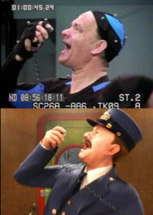
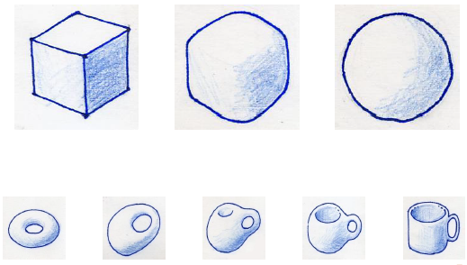
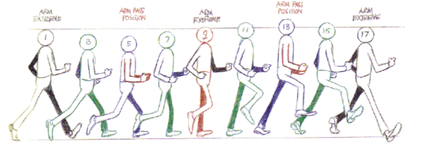

# Revisão

> Esse resumo foi inicialmente escrito pelo Marcos, e eu, Caio, apenas complementei as informações com base no que eu já produzi na área de desenvolvimento de jogos com o Sonar, LightIO e outros jogos. Novamente, digo que **algumas informações aqui dispostas são completamente pessoais, mas não interferem no resumo.**

## Animação

### Definições

- Enganar os olhos do espectador dando movimento a objetos inanimados;
- Ofício de dar movimento a objetos inanimados;
- Arte de dar movimento a objetos inanimados;
- Arte de dar vida a objetos inanimados;
- Arte de dar vida a objetos, personagens e cenários;

### Métodos

- Keyframing;
- Simulações Físicas:
  - Rigid bodies;
  - Soft bodies:
    - Cloth Simulation;
    - Boing;
    - Fluids;
  - Cellular Automata (ex: nuvens);
  - Flocking & Herding (ex: enxame. Definição = conjunto/bando);
  - Particles (ex: fogo, efeitos visuais em geral);
  - Fênomenos naturais (ex: tsunami);
- Motion Capture;
- Scripting (A animação é feita por código, ex: simulações físicas);
- Interpolação;
- Curvas;

Os que não possuem exemplos, estão mais definidos abaixo, visto que são técnicas mais comuns de animação:

#### Keyframing

É a técnica de chavear quadros (ou quadro-chave), definem-se os pontos de início e fim de qualquer transição entre imagens. No caso do Blender, utilizamos _keyframing_ quando fizemos uma animação definindo a posição / tamanho / outra propriedade de um objeto na _timeline_, avançamos o tempo e modificamos estas mesmas propriedades do objeto.

#### Rigid e Softbody

##### Rigidbody

São simulações baseadas na física, podemos utilizar o jogo Angry Birds como um exemplo de jogo baseado em física, que abusa das animações físicas, como o vôo dos pássaros e as colisões nas estruturas.

##### Softbody e derivados

Ainda são baseadas em física, a diferença é que por se tratar de um objeto deformável (a distância entre dois pontos podem variar conforme a física aplicada), esse tipo de animação é usada em materiais como músculos, gorduras, cabelo, vegetação, roupas/panos etc.

#### Motion Capture

A imagem deve ser suficiente pra definir.

> Inclusive The Last of Us foi feito desta forma.

#### Interpolação

### Como fazer

A tecla `i` insere os Keyframes e possuem as opções de Location (posicionamento), scalling (escala), rotation (rotação) etc.

## Personagem

### Storyboard

Criação a partir de um desenho / imagem. Usar o "storyboard" significa usar um desenho da lateral e um da frente do personagem (as vezes é nomeado blueprint). Personagens são modelados a partir de objetos iniciais.

## Pontuação

- Crie uma cena nova.
- Coloque a camera virada pra baixo (para o chão).
- Adiciona um texto que vai ser a pontuação, coloque-o usando a visão da camera (Numpad 0).
- Crie uma propriedade pra quando uma mensagem for recebida com um nome, adicionar valor na propriedade de pontuação.
- Quando o player colidir com uma moeda, emita essa mensagem usando o game logic.
- Adicione a camera no game logic como um overlay:

## Comandos comuns

Atalho / Modificador | Ação / Descrição
:-: | :-:
**CTRL + R** | Divisões nos objetos.
**E** | Extrusão;
**MIRROR** | O que mexer de um lado altera do outro. Quando estiver usando o mirror para modelar o personagem ativar a função “Clipping” nas configurações do modificador para que as partes permaneçam juntas.
**SUBDIVISION SURFACE** | Suaviza as faces.
**S** | Escalonar.
**G** | Permite movimentar o objeto.
**B e C** | Seleção de faces/arestas/vértices.
**Shift + D** | Copia/duplica o objeto selecionado.
**F** | Junta as vértices/faces/edges (depende de qual esta selecionado). Selecionar segurando o ALT seleciona todas as vértices/faces/edges do obj que esta sendo editado.
**A + A** | Seleciona tudo (depende do modo).

---

Revisão geral feita pelo Marcos, obrigado. :heart:

[Gabarito da prova](https://hackatomic.com)
